# How to use Nginx as a reverse proxy server

This is a tutorial on how to use Nginx as a reverse proxy to be able to split your application into different containers.

## Step 0 : Prerequisites

I have the following softwares installed on my machine.

* [Docker for Windows](https://www.docker.com/)
* [Visual Studio Code](https://code.visualstudio.com/)

We will use Linux containers for this demo so switch Docker for Windows to use Linux containers.

## Step 1 : Create a web site in a container with Nginx as the webserver

Start by creating the project folder and create a folder named site in that. Than add a source folder in the site folder. Than add an index.html file in the source folder.

Add the following html code to index.html

```html
<html>
    <head><title>My Site</title></head>
    <body>
        <h1>My Site</h1>
    </body>
</html>
```

Add a file named Dockerfile to the homepage folder with the following code.

```docker
FROM nginx

COPY site/source/ /usr/share/nginx/html
```

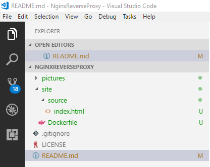  
*The folder structure should now look like this*

The Docker file will copy the source code for our web site to our Nginx image.

Run the following command from the project folder in a powershell och command prompt to build the Docker image for the website.

```powershell
docker build -t site -f .\site\Dockerfile .
```

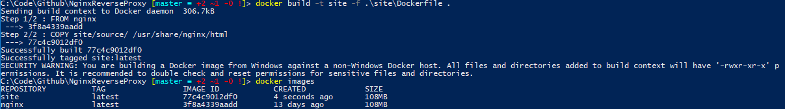  
*An image named "site" are now created*

Run the following command to start a container with our website. We mapp port 8080 on the host to port 80 in the container. This means that if we browse to [http://localhost:8080](http://localhost:8080) we should see our new website.

```powershell
docker run -d --name site -p 8080:80 site
```

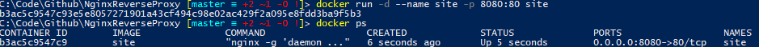  
*The site container is running and the port 8080 on the host are mapped to port 80 in the container*

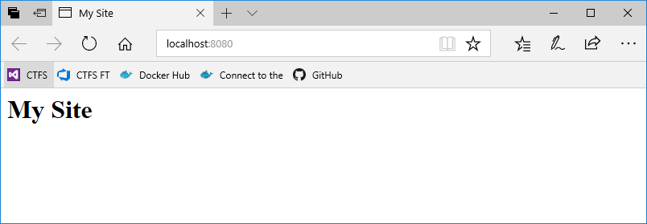  
*The website in a browser*

Open a browser and go the [http://localhost:8080](http://localhost:8080) and you will se our beautiful website.

We managed to create a website with one page and add it to a Docker image based on the Nginx image and expose the site on port 8080 on our Docker host.

Now we will add a second page to the website. Add a folder nameed subsite in the source folder. Add source folder and a index.html in the subsite/source folder with the following html code.

```html
<html>
    <head><title>My Site</title></head>
    <body>
        <h1>Subsite</h1>
    </body>
</html>
```

Add a link the the first index.html file in the source folder.

```html
<html>
    <head><title>My Site</title></head>
    <body>
        <h1>My Site</h1>
        <a href="./subsite/index.html">Subsite</a>
    </body>
</html>
```

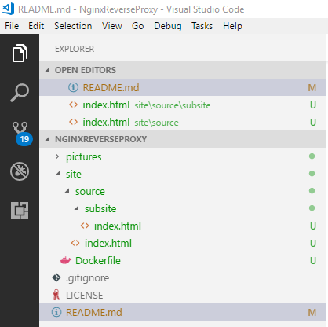  
*The folder structure after adding subsite*

Delete the running container and the image by running the following commands.

```powershell
docker rm site -f
docker rmi site -f
```

Now rebuild the image and run the container again.

```powershell
docker build -t site -f .\site\Dockerfile .
docker run -d --name site -p 8080:80 site
```

Refresh the browers an you willnow be able to go the the subsite page by clicking the subsite link.

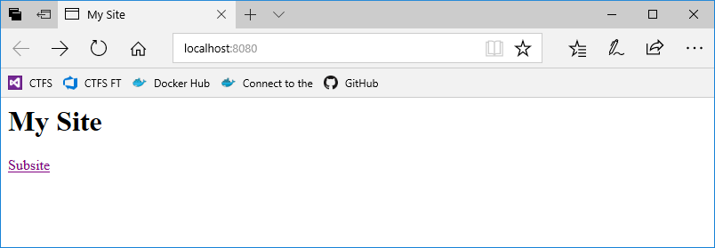  
*Added a link to the second page in our website*

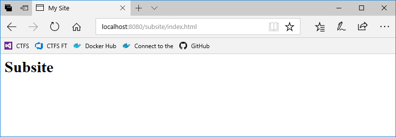  
*The new page*

## Step 2 : Add a reverse proxy server in front of our site container

Let's pretend the subsite in our solution will be replaced by a new one and you are assigned to do the job. When I am assigned to do someting to an old codebase that I have not worked with before I am scared that I will breake someting that worked before. Wouldn't it be great if we could replace the functionality without having to change the old solution?

First we need an reverse proxy to be able to route different addresses to different containers. We once again use Nginx server to help us.

Create a new folder called proxy in the project folder. Add a Dockerfile with the following content.

```docker
FROM nginx

EXPOSE 80

COPY proxy/conf /etc/nginx
```

Create a conf folder in the proxy folder and a file named nginx.conf with the following content.

```txt
worker_processes 1;

events {
    worker_connections 1024;
}

http {
    proxy_set_header Host $host;
    proxy_pass_request_headers on;

    server {
        server_name _;
        listen 80 default_server;

        location / {
            proxy_pass http://site/;
        }
    }
}
```

We add the configuration for the Nginx proxy container to route all calls to the site container in the location property in the nginx.conf file. When we started our site container we will give it the name "site" and the address http://site is enough for our proxy container to find the site container using Dockers internal DNS.

First we need to cleanup the old contianer. Delete the site container by running the following command.

```powershell
docker rm site -f
```

Build the proxy image by running the following command.

```powershell
docker build -t proxy -f .\proxy\Dockerfile .
```

To use the DNS in Docker we need to create a network and add both of our containers to it. To create a network named "Test" run the following command.

```powershell
docker network create Test
```

If you need you can specify the ip range for the network with the --subnet argument.

```powershell
docker network create --subnet 192.168.1.0/16 Test
```

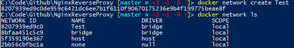  
*The "Test" are created*

Now start both containers with the network flag and map port 80 on the host to port 80 in the proxy container.

```powershell
docker run -d -P --name site --network Test site
docker run --name proxy -d -p 80:80 --network Test proxy
```

Now try to go to [http://localhost](http://localhost) in a browser. The site works like before but now we have a reverse proxy server in front of our website container.

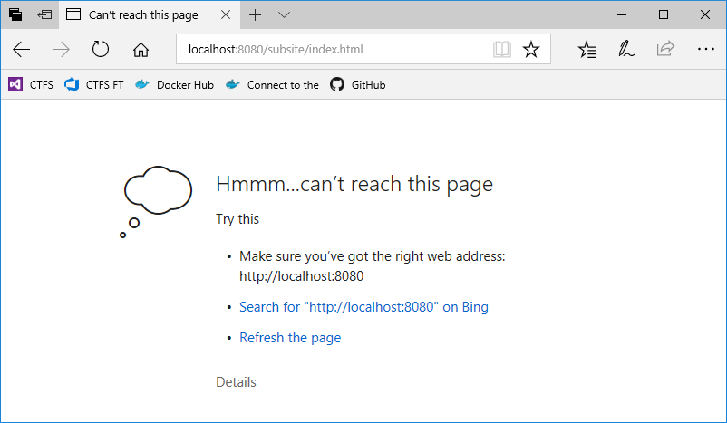  
*The old container no loger exists and we get an error trying to refresh the brower*

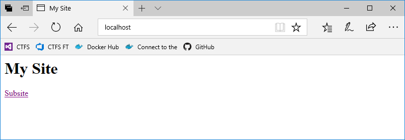  
*Port 80 on the host are now mapped to port 80 in the proxy container*

  
*The subsite link works as well*

Now we added a reverse proxy container in front of our site container so that we can configure routes for different addresses when needed. This will help us route the traffic to the new subsite container when it is ready for deployment.

## Step 3 : Add a new container with the new implementation of the subsite

Now that we have an reverse proxy in place we finally can start working on our new subsite functionallity. Start by creating a new folder for our new subsite. Add a source folder with a new index.html with the following code.

```html
<html>
    <head><title>My Site</title></head>
    <body>
        <h1>New Subsite</h1>
    </body>
</html>
```

Add a Dockerfile for our new subsite image.

```docker
FROM nginx

COPY subsite/source/ /usr/share/nginx/html/subsite
```

Add a route for the subsite path in the nginx.conf file.

```txt
worker_processes 1;

events {
    worker_connections 1024;
}

http {
    proxy_set_header Host $host;
    proxy_pass_request_headers on;

    server {
        server_name _;
        listen 80 default_server;

        location / {
            proxy_pass http://site/;
        }

        location /subsite/ {
            proxy_pass http://subsite;
        }
    }
}
```

The nginx.conf file should now look as the code above.

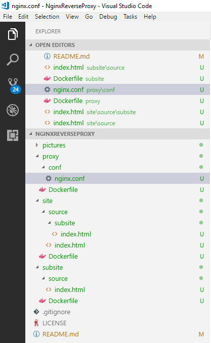  
*The folder structure should now look like this*

Delete the proxy container.

```powershell
docker rm proxy -f
```

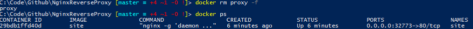  
*Only the "site" container is running*


Build a new proxy image.

```powershell
docker build -t proxy -f .\proxy\Dockerfile .
```

Build the image for the new subsite container.

```powershell
docker build -t subsite -f .\subsite\Dockerfile .
```

Start the proxy and subsite container and add them to the Test network.

```powershell
docker run -d -P --name subsite --network Test subsite
docker run --name proxy -d -p 80:80 --network Test proxy
```

Once again browse to [http://localhost](http://localhost) and verify that when you click on the subsite link you will end up on the new subsite page.

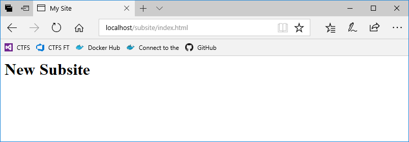  
*The traffic to the subsite page are now routed to the new subsite container*

We have now replaced the subsite in the site container with a new container containing the subsite functionallity without touching the site container.
The application is now divided into two distinct parts that can be developed and deployed independent of each other. Creating images, containers and networks from the command line can be error-prone, we need a different way to manage the images, continers and networks for our solution.

## Step 4 : Use docker-compose to manage the containers and network

First let's clean up the running containers and the "Test" network.

```powershell
docker rm site subsite proxy -f
docker network rm Test
```

To use docker-compose we need a docker-compose file that specifies the containers, network and ports. Create a new file named docker-compose.yml in the project folder.

```yml
version: '3.3'

services:

  site:
    image: site
    networks:
      - app-net

  subsite:
    image: subsite
    networks:
      - app-net

  proxy:
    image: proxy
    ports:
      - "80:80"
    depends_on:
      - site
      - subsite
    networks:
      - app-net

networks:
  app-net:
```

If you need you can specify the ip range for the network with the -subnet configuration.

```yml
networks:
  app-net:
    ipam:
      driver: default
      config: 
        - subnet: 192.168.1.0/16
```

We use version 3.3 of the docker-compose file format. We specify witch services (containers) our application consists of. In our case site, subsite ans proxy. The image property of a service defines the image that should be used to create the container. We also specify a network that the container should be attached to. In our case the network is named app-net. The proxy service also specifies a port mapping so that we can talk to the proxy container on port 80. The proxy service also depends on the site and subsite services. Docker-compose will create the site and subsite container before the proxy container in this case. This docker file reqires that the images in present in your image registry. This docker-compose file are ment to be used in a test or production environment.

```powershell
docker-compose -f .\docker-compose.yml up -d
```

In a develompment environment you probably want to build the images before you create the containers and we can do this by adding another docker-compose file that specifies the Dockerfile paths for each service.

Create an new file named docker-compose.build.yml with the following content in the project folder.

```yml
version: '3.3'

services:

  site:
    build:
      context: ./
      dockerfile: ./site/Dockerfile

  subsite:
    build:
      context: ./
      dockerfile: ./subsite/Dockerfile

  proxy:
    build:
      context: ./
      dockerfile: ./proxy/Dockerfile
```

Start by deleting the containers, images.

```powershell
docker-compose -f .\docker-compose.yml down
docker rmi site subsite proxy -f
```

To use docker-compose to build all images and run the containers use the following command. The --build indicates that the immages will only be builded not start the containers. This command i sutible to run on a build server to creata all images for the application.

```powershell
docker-compose -f .\docker-compose.yml -f .\docker-compose.build.yml build
```

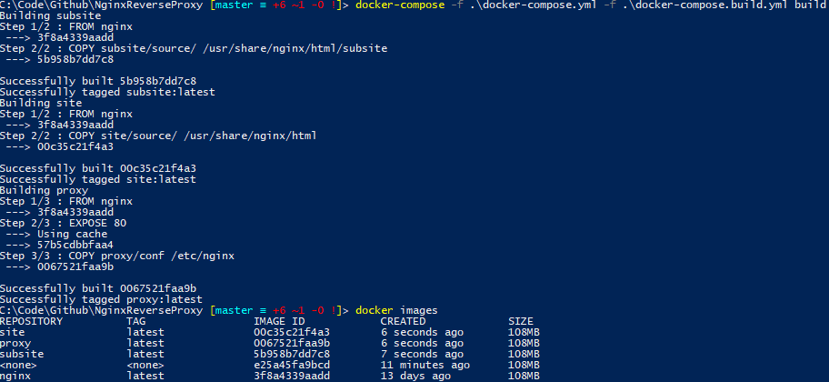  
*The site, subsite and proxy images are recreated*

On a development machine you probably want to rebuild and restart the containers.

```powershell
docker-compose -f .\docker-compose.yml -f .\docker-compose.build.yml up --build -d
```

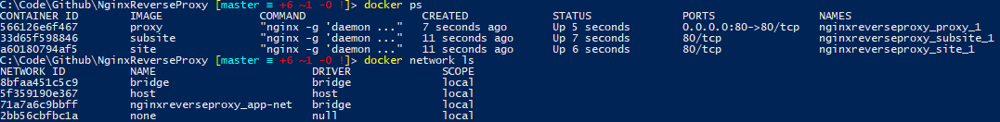  
*The containers and network are created*

When you want to delete the application you run the docker-compose down command.

```pwershell
docker-compose -f .\docker-compose.yml down
```

This will delete the containers and networks but keep the images in your local registry cache.

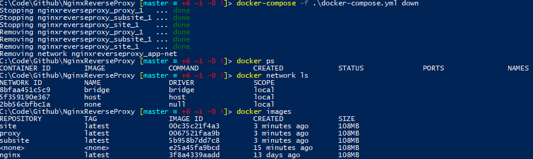  
*The containers and network are deleted but the images are still there*
